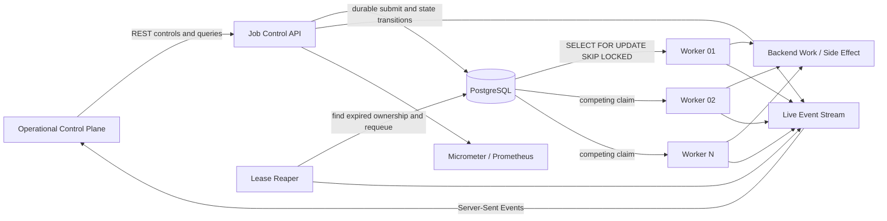
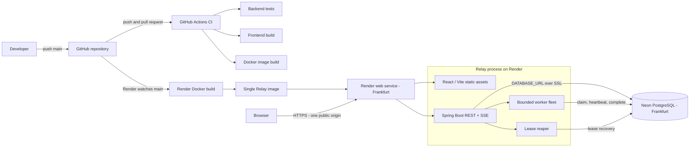

# Relay

**Distributed Job Execution & Recovery Platform**

**Live system:** https://relay-platform-mmms.onrender.com

Relay is a durable execution platform for backend work that cannot safely stay inside a synchronous HTTP request. It persists accepted jobs before execution, assigns work to competing workers, recovers abandoned jobs after worker failure, retries transient dependency failures with exponential backoff and jitter, suppresses duplicate submissions with idempotency keys, and exposes the execution lifecycle through a live operational control plane.

The problem is simple to state and difficult to get right:

> Teams move slow or failure-prone work into background workers, then rebuild retry, recovery, idempotency, scheduling, and job-tracking logic service by service.

Relay turns those guarantees into a shared execution primitive.

## Start here: run the guided failure scenario

Open the live system and select **RUN GUIDED FAILURE SCENARIO**.

The scenario takes roughly 15 seconds and drives the real backend through five states:

1. **Create durable backlog** — 320 jobs are persisted before execution.
2. **Terminate a busy worker** — a worker loses heartbeat while owning work.
3. **Recover the expired lease** — the reaper requeues abandoned work and a replacement worker joins the fleet.
4. **Inject HTTP 503 failures** — transient failures enter retry wait with backoff and jitter.
5. **Submit 100 duplicate requests** — one idempotency key resolves to one durable job.

Watch the control plane while it runs: **queue depth → worker state → lease recovery → retry events → idempotency result**.

The interface is driven by backend state and Server-Sent Events. It is not a scripted animation.

## What Relay is proving

- **Accepted work has durable state.** A request is acknowledged only after the job exists in PostgreSQL.
- **A dead worker does not permanently strand work.** Lease expiry makes abandoned jobs runnable again.
- **Retries are failure-aware.** Transient failures back off; permanent or exhausted failures enter the dead-letter state.
- **At-least-once execution is treated honestly.** Relay models the crash window between a successful side effect and persistence of `SUCCEEDED`.
- **Duplicate requests do not imply duplicate logical work.** Submission and side-effect idempotency have explicit uniqueness boundaries.
- **Workflow dependencies are validated algorithmically.** DAG submissions use Kahn's algorithm for cycle detection and dependency readiness.

## Runtime architecture



The architecture above matches the system behaviour visible in the live control plane. The PostgreSQL queue is the coordination boundary; workers compete for runnable rows, lease ownership is stored durably, and the reaper recovers expired ownership.

The public deployment uses a bounded in-process worker fleet so the complete system fits inside constrained cloud resources. The same claim protocol also supports independently deployed worker processes. The repository includes `docker-compose.distributed.yml` for that topology.

## Public deployment topology



### How the public system reaches a running state

1. Code is pushed to the `main` branch on GitHub.
2. GitHub Actions validates backend tests, the React production build, and the deployment container build.
3. Render watches `main` and builds the root multi-stage `Dockerfile`.
4. Vite compiles the React control plane; the Docker build copies those static assets into the Spring Boot classpath.
5. Render starts one Java 21 web service in Frankfurt and injects the Neon connection string through `DATABASE_URL`.
6. Spring Boot connects to Neon over SSL and Flyway applies versioned schema migrations.
7. After application startup, the bounded worker fleet registers and begins competing for jobs.
8. The browser receives the React interface, REST APIs, and SSE event stream from the same Render origin.

GitHub Actions and Render both consume the GitHub repository. CI validates the project; Render performs the public deployment from `main`.

## Live control plane

After the guided path, individual controls let an engineer inspect one failure mode at a time:

- `RUN 1K BURST` — submit a durable backlog and watch the queue drain.
- `TERMINATE WORKER` — stop an active worker and observe heartbeat loss and lease recovery.
- `INJECT HTTP 503` — create transient dependency failures and inspect retry timing.
- `SUBMIT DUPLICATES` — send 100 concurrent requests with one idempotency key.
- `CRASH AFTER SIDE EFFECT` — model the at-least-once crash window.
- `RUN DAG WORKFLOW` — submit dependent work with parallel independent nodes.
- `START REPLACEMENT` — add another worker runtime to the fleet.
- `RESET SYSTEM` — clear durable workload state for the next controlled run.

The **Job Explorer** exposes durable jobs and attempt history. **System Metrics** shows queue, throughput, running work, retry, recovery, and latency state. **Engineering Notes** explains the design trade-offs directly in the live system.

## Core guarantees and failure semantics

### Durable acceptance

A job is accepted only after it is written to PostgreSQL. Worker execution is decoupled from request lifetime.

### At-least-once execution

Relay does **not** claim exactly-once execution. A worker can complete a side effect and crash before persisting success. The job will eventually be reclaimed after lease expiry.

### Idempotent side-effect boundary

Submission idempotency uses a partial unique index on `(tenant_id, idempotency_key)`. Simulated external side effects use their own unique effect key so retry after the crash window does not repeat the business action.

### Lease-based ownership and fencing

`RUNNING` means a worker currently owns a time-limited lease. Heartbeats extend that lease. If the worker disappears, the reaper atomically returns the job to `QUEUED` and marks the unfinished attempt `ABANDONED`.

Every completion, retry, and dead-letter transition is fenced by the current `lease_owner` **and an unexpired lease**. A late or stale worker cannot renew an already expired lease or overwrite state after its ownership window ends; Relay records the attempt as `STALE` and rejects the transition.

### Failure-aware retries

Transient failures enter `RETRY_WAIT` with capped exponential backoff and jitter. Permanent failures move directly to `DEAD_LETTER`. Exhausted transient failures also enter `DEAD_LETTER`.

### Workflow DAG validation

Workflow dependencies are validated with Kahn's algorithm before persistence. Cycles are rejected. Nodes with dependencies start `BLOCKED`; a successful parent unblocks a child only when every parent is `SUCCEEDED`.

### Public control-plane rate limiting

Interactive failure injection is guarded by a synchronized token bucket. Expensive controls such as burst submission, worker termination, and reset consume different token costs and refill over time. This protects the public live system without making the control plane read-only.

## Technology

- Java 21
- Spring Boot 4.1
- Spring JDBC + Flyway
- PostgreSQL / Neon
- React 19 + Vite 8
- Server-Sent Events
- Micrometer + Prometheus
- Grafana
- Docker / Docker Compose
- GitHub Actions
- Render Blueprint deployment
- k6 load-test scripts
- Kahn's algorithm for DAG validation
- Token-bucket control-plane rate limiting

## Run locally

Requirements: Docker and Docker Compose.

```bash
cp .env.example .env
docker compose up --build
```

Open:

```text
http://localhost:8080
```

Health:

```text
http://localhost:8080/actuator/health
```

Prometheus-format metrics:

```text
http://localhost:8080/actuator/prometheus
```

Start the optional local observability stack:

```bash
docker compose --profile observability up --build
```

Run the split-process topology with one API/recovery process and two independently deployed worker processes, four workers each:

```bash
docker compose -f docker-compose.distributed.yml up --build
```

Terminate an entire worker process from another terminal:

```bash
docker compose -f docker-compose.distributed.yml kill relay-worker-a
```

The API-side reaper detects lease expiry and the surviving worker process reclaims abandoned jobs. The public deployment keeps the fleet in-process so an operator can target an individual worker while remaining within free web-service constraints.

Local observability endpoints:

```text
Prometheus  http://localhost:9090
Grafana     http://localhost:3000
```

Grafana credentials for the local stack are `admin / relay`.

## Public deployment

The current public system uses **Render for the Docker web service and Neon for PostgreSQL**, both in Frankfurt. The repository's `render.yaml` prompts for `DATABASE_URL` during initial Blueprint creation.

1. Create a Neon PostgreSQL project and copy its connection string.
2. Push Relay to GitHub.
3. In Render, create a Blueprint from the repository.
4. When Render prompts for `DATABASE_URL`, paste the Neon connection string.
5. Render builds the root `Dockerfile`.
6. Flyway creates or migrates the Relay schema on startup.
7. The control plane becomes available from the Render web-service URL.

The root Dockerfile builds the Vite frontend and copies the production assets into the Spring Boot classpath, so the live system is served from one public origin. `DataSourceConfig` preserves SSL options from provider connection strings and maps Neon's libpq-style `channel_binding` option to pgJDBC's `channelBinding` property.

A fully Render-managed alternative is included as `render-temporary-db.yaml`. Its database is intentionally documented as temporary because Render's free PostgreSQL instances are not the persistence choice used by the public Relay link.

## API

### Submit a job

```bash
curl -X POST http://localhost:8080/api/jobs \
  -H 'Content-Type: application/json' \
  -d '{
    "tenantId": "billing",
    "jobType": "SIMULATED_SIDE_EFFECT",
    "payload": {
      "durationMs": 500,
      "failureMode": "NONE",
      "effectKey": "invoice:customer-42:2026-07"
    },
    "idempotencyKey": "invoice:customer-42:2026-07"
  }'
```

### Inspect a job

```bash
curl http://localhost:8080/api/jobs/<job-id>
curl http://localhost:8080/api/jobs/<job-id>/attempts
```

### Submit a DAG workflow

```bash
curl -X POST http://localhost:8080/api/workflows \
  -H 'Content-Type: application/json' \
  -d '{
    "name": "customer-processing",
    "tenantId": "analytics",
    "nodes": [
      {"key":"ingest","jobType":"INGEST","payload":{"durationMs":500,"failureMode":"NONE"},"dependsOn":[]},
      {"key":"validate","jobType":"VALIDATE","payload":{"durationMs":400,"failureMode":"NONE"},"dependsOn":["ingest"]},
      {"key":"score","jobType":"SCORE","payload":{"durationMs":900,"failureMode":"NONE"},"dependsOn":["validate"]},
      {"key":"enrich","jobType":"ENRICH","payload":{"durationMs":700,"failureMode":"NONE"},"dependsOn":["validate"]},
      {"key":"publish","jobType":"PUBLISH","payload":{"durationMs":300,"failureMode":"NONE"},"dependsOn":["score","enrich"]}
    ]
  }'
```

## Load testing

Submission load:

```bash
k6 run k6/burst.js
```

Idempotency stress:

```bash
k6 run k6/idempotency.js
```

Do not put invented performance numbers in the project description or resume. Run the workloads on the environment being discussed and record:

- accepted jobs
- peak queue depth
- sustained completion throughput
- P95/P99 execution latency
- worker count
- lease duration
- crash-to-requeue recovery latency
- retries per failure scenario
- database CPU / active connections
- the worker count at which throughput plateaus

Use `benchmarks/results-template.md` to capture measurements.

## Repository layout

```text
backend/                       Spring Boot API, worker fleet, lease reaper, state machine
frontend/                      React operational control plane and guided scenario
k6/                            load and idempotency stress workloads
observability/                 Prometheus and Grafana configuration
docs/adr/                      architecture decision records
benchmarks/                    repeatable measurement notes
.github/workflows/ci.yml       backend, frontend, and container CI
render.yaml                    Render + external PostgreSQL Blueprint
render-temporary-db.yaml       temporary all-Render alternative
Dockerfile                     multi-stage single-origin deployment image
docker-compose.yml             local integrated topology
docker-compose.distributed.yml split API / worker-process topology
```

## Engineering decisions

Read the ADRs:

- [ADR-001: PostgreSQL as the coordination boundary](docs/adr/001-postgres-coordination.md)
- [ADR-002: At-least-once execution](docs/adr/002-at-least-once.md)
- [ADR-003: Lease-based recovery](docs/adr/003-lease-recovery.md)
- [ADR-004: SSE operational control plane](docs/adr/004-sse-control-plane.md)
- [ADR-005: DAG workflow validation](docs/adr/005-workflow-dag.md)

## License

MIT
