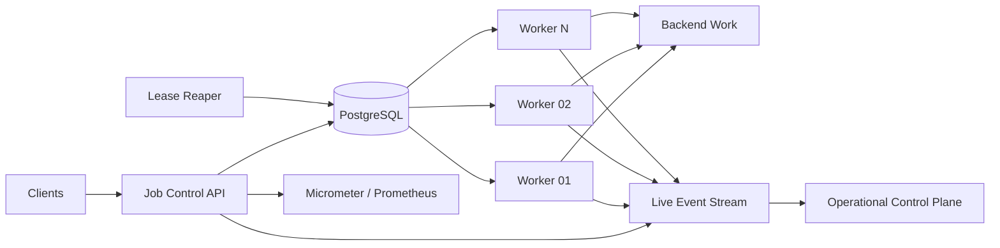

# Relay

**Distributed Job Execution & Recovery Platform**

Relay is a durable execution platform for backend work that cannot safely stay inside a synchronous HTTP request. It accepts jobs, persists them before execution, assigns work to competing workers, recovers abandoned jobs after worker failure, retries transient dependency failures with exponential backoff and jitter, suppresses duplicate submissions with idempotency keys, and exposes the entire execution lifecycle through a live operational control plane.

The problem Relay solves is simple to state and difficult to get right:

> Teams move slow or failure-prone work into background workers, then rebuild retry, recovery, idempotency, scheduling, and job-tracking logic service by service.

Relay turns those guarantees into a shared execution primitive.

## What is visible in the live system

The root URL is the control plane. It is driven by real backend state and Server-Sent Events, not scripted animation.

- Run a 1,000-job burst and watch queue depth grow and drain.
- Terminate a worker and watch its heartbeat stop, lease expire, and abandoned job return to the runnable queue.
- Inject HTTP 503-style dependency failures and inspect exponential retry timing and attempt history.
- Submit 100 requests with the same idempotency key and observe one durable job.
- Trigger the crash window where a side effect succeeds but the worker dies before persisting `SUCCEEDED`; the recovered execution reuses the side-effect key instead of duplicating the action.
- Submit a DAG workflow. Independent nodes run in parallel and dependent nodes remain `BLOCKED` until their indegree reaches zero through completed dependencies.

## Architecture



The public deployment uses a bounded in-process worker fleet so the complete system fits inside constrained cloud resources. The claim protocol is database-coordinated: multiple Relay application instances can compete for jobs through `SELECT ... FOR UPDATE SKIP LOCKED` against the same durable queue.

## Core guarantees and failure semantics

### Durable acceptance

A job is accepted only after it is written to PostgreSQL. Worker execution is decoupled from request lifetime.

### At-least-once execution

Relay does **not** claim exactly-once execution. A worker can complete a side effect and crash before persisting success. The job will eventually be reclaimed after lease expiry.

### Idempotent side-effect boundary

Submission idempotency uses a partial unique index on `(tenant_id, idempotency_key)`. Simulated external side effects use their own unique effect key so retry after the crash window does not repeat the business action.

### Lease-based ownership

`RUNNING` means a worker currently owns a time-limited lease. Heartbeats extend that lease. If the worker disappears, the reaper atomically returns the job to `QUEUED` and marks the unfinished attempt `ABANDONED`.

Every completion, retry, and dead-letter transition is fenced by the current `lease_owner` **and an unexpired lease**. A late or stale worker cannot renew an already expired lease or overwrite state after its ownership window ends; Relay records the attempt as `STALE` and rejects the transition.

### Failure-aware retries

Transient failures enter `RETRY_WAIT` with capped exponential backoff and jitter. Permanent failures move directly to `DEAD_LETTER`. Exhausted transient failures also enter `DEAD_LETTER`.

### Workflow DAG validation

Workflow dependencies are validated with Kahn's algorithm before persistence. Cycles are rejected. Nodes with dependencies start `BLOCKED`; a successful parent unblocks a child only when every parent is `SUCCEEDED`.

### Public control-plane rate limiting

Interactive failure injection is guarded by a synchronized token bucket. Expensive controls such as burst submission, worker termination, and reset consume different token costs and refill over time. This protects the public live system without making the control plane read-only.

## Technology

- Java 21
- Token-bucket control-plane rate limiting
- Spring Boot 4.1
- PostgreSQL
- Spring JDBC + Flyway
- React 19 + Vite 8
- Server-Sent Events
- Micrometer + Prometheus
- Grafana
- Docker / Docker Compose
- k6 load-test scripts

## Run locally

Requirements: Docker and Docker Compose.

```bash
cp .env.example .env
docker compose up --build
```

Open:

```text
http://localhost:8080
```

Health:

```text
http://localhost:8080/actuator/health
```

Prometheus-format metrics:

```text
http://localhost:8080/actuator/prometheus
```

Start the optional local observability stack:

```bash
docker compose --profile observability up --build
```

Run the split-process topology with one API/recovery process and two independently deployed worker processes (four workers each):

```bash
docker compose -f docker-compose.distributed.yml up --build
```

In that topology, terminate an entire worker process from another terminal:

```bash
docker compose -f docker-compose.distributed.yml kill relay-worker-a
```

The API-side reaper detects lease expiry and the surviving worker process reclaims abandoned jobs. The public deployment keeps the fleet in-process so the interactive `TERMINATE WORKER` control can target an individual worker while remaining within free web-service constraints.

Then open:

```text
Prometheus  http://localhost:9090
Grafana     http://localhost:3000
```

Grafana credentials for the local stack are `admin / relay`.

## Public deployment

The recommended zero-cost path uses **Render for the Docker web service and Neon for PostgreSQL**. The repository's `render.yaml` prompts for `DATABASE_URL` during initial Blueprint creation.

1. Create a Neon Free Postgres project and copy its connection string.
2. Push Relay to GitHub.
3. In Render, create a Blueprint from the repository.
4. When Render prompts for `DATABASE_URL`, paste the Neon connection string.
5. Render builds the root `Dockerfile`; Flyway creates the Relay schema on startup and the control plane is exposed from the web service URL.

The root Dockerfile builds the Vite frontend and copies the production assets into the Spring Boot classpath, so the live system is served from one public origin. `DataSourceConfig` preserves SSL options from provider connection strings and maps Neon's libpq-style `channel_binding` option to pgJDBC's `channelBinding` property.

A fully Render-managed alternative is included as `render-temporary-db.yaml`. Its database is intentionally documented as temporary because Render's Free Postgres instances expire after 30 days; use the default `render.yaml` path for a long-lived public link.

## API

### Submit a job

```bash
curl -X POST http://localhost:8080/api/jobs \
  -H 'Content-Type: application/json' \
  -d '{
    "tenantId": "billing",
    "jobType": "SIMULATED_SIDE_EFFECT",
    "payload": {
      "durationMs": 500,
      "failureMode": "NONE",
      "effectKey": "invoice:customer-42:2026-07"
    },
    "idempotencyKey": "invoice:customer-42:2026-07"
  }'
```

### Inspect a job

```bash
curl http://localhost:8080/api/jobs/<job-id>
curl http://localhost:8080/api/jobs/<job-id>/attempts
```

### Submit a DAG workflow

```bash
curl -X POST http://localhost:8080/api/workflows \
  -H 'Content-Type: application/json' \
  -d '{
    "name": "customer-processing",
    "tenantId": "analytics",
    "nodes": [
      {"key":"ingest","jobType":"INGEST","payload":{"durationMs":500,"failureMode":"NONE"},"dependsOn":[]},
      {"key":"validate","jobType":"VALIDATE","payload":{"durationMs":400,"failureMode":"NONE"},"dependsOn":["ingest"]},
      {"key":"score","jobType":"SCORE","payload":{"durationMs":900,"failureMode":"NONE"},"dependsOn":["validate"]},
      {"key":"enrich","jobType":"ENRICH","payload":{"durationMs":700,"failureMode":"NONE"},"dependsOn":["validate"]},
      {"key":"publish","jobType":"PUBLISH","payload":{"durationMs":300,"failureMode":"NONE"},"dependsOn":["score","enrich"]}
    ]
  }'
```

## Load testing

A submission-load script is in `k6/burst.js`.

```bash
k6 run k6/burst.js
```

Idempotency stress:

```bash
k6 run k6/idempotency.js
```

Do not put invented performance numbers in the project description or resume. Run the workloads on the environment you intend to discuss and record:

- accepted jobs
- peak queue depth
- sustained completion throughput
- P95/P99 execution latency
- worker count
- lease duration
- crash-to-requeue recovery latency
- retries per failure scenario
- database CPU / active connections
- the worker count at which throughput plateaus

Use `benchmarks/results-template.md` to capture the measurements.

## Repository layout

```text
backend/         Spring Boot API, worker fleet, lease reaper, job state machine
frontend/        React operational control plane
k6/             load and idempotency stress workloads
observability/   Prometheus and Grafana configuration
docs/adr/        architecture decision records
benchmarks/      repeatable measurement notes
render.yaml      recommended Render + external PostgreSQL blueprint
render-temporary-db.yaml  temporary all-Render alternative
Dockerfile       single-origin production image
docker-compose.yml
docker-compose.distributed.yml  split API / worker-process topology
```

## Engineering decisions

Read the ADRs:

- [ADR-001: PostgreSQL as the coordination boundary](docs/adr/001-postgres-coordination.md)
- [ADR-002: At-least-once execution](docs/adr/002-at-least-once.md)
- [ADR-003: Lease-based recovery](docs/adr/003-lease-recovery.md)
- [ADR-004: SSE operational control plane](docs/adr/004-sse-control-plane.md)
- [ADR-005: DAG workflow validation](docs/adr/005-workflow-dag.md)

## License

MIT
